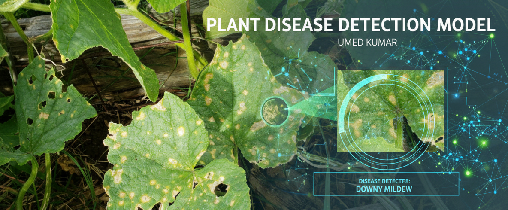
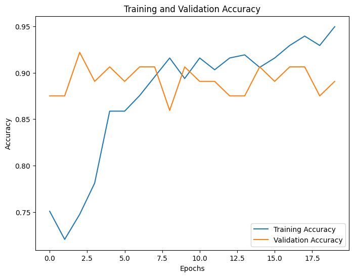
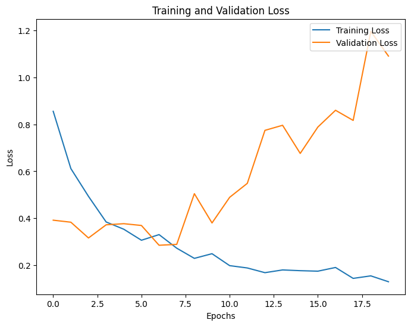

# Plant Disease Detection Using Transfer Learning with ResNet50



This project leverages transfer learning with a pre-trained ResNet50 model to detect plant diseases from leaf images. The model is fine-tuned to classify plant leaves as either **Healthy** or **Diseased**. By utilizing data augmentation techniques and handling imbalanced data with class weights, the model's performance and reliability are significantly improved.

This approach enhances the speed and accuracy of plant disease detection, aiding farmers and agricultural experts in taking timely action to protect crops and improve yields.

## Table of Contents
- [Project Overview](#project-overview)
- [Features](#features)
- [Methodology](#methodology)
- [Dataset](#dataset)
- [Usage](#usage)
- [Results](#results)
- [Conclusion](#conclusion)

## Project Overview
Plant diseases pose a significant threat to agricultural productivity and food security worldwide. Early detection and accurate diagnosis are crucial for effective management. This project demonstrates an automated and accurate solution using deep learning.

## Features
- **Transfer Learning:** Utilizes the powerful ResNet50 architecture pre-trained on ImageNet.
- **Data Augmentation:** Artificially expands the training dataset to improve model generalization (`shear`, `zoom`, `rotation`, `flips`).
- **Class Imbalance Handling:** Uses class weights to give more importance to the minority class, preventing model bias.
- **Binary Classification:** Classifies leaves into two categories: `Healthy` or `Diseased`.

## Methodology

The project follows these key steps:

1.  **Data Preprocessing:**
    * The dataset is unzipped and loaded.
    * An `ImageDataGenerator` is used for data augmentation and splitting the data into training (80%) and validation (20%) sets.
    * Images are resized to `224x224` pixels to match ResNet50's input shape.

2.  **Handling Data Imbalance:**
    * The distribution of classes was found to be imbalanced.
    * `class_weight` from `scikit-learn` was used to calculate weights that penalize the model more for misclassifying the minority class. The calculated weights were:
        - `Diseased (Class 0): 0.56`
        - `Healthy (Class 1): 4.45`

3.  **Model Building:**
    * A **ResNet50** model is loaded with its pre-trained ImageNet weights, excluding the final classification layer (`include_top=False`).
    * The last 10 layers of the base model are unfrozen to allow for fine-tuning on our specific dataset.
    * A custom classification head is added on top:
        - `GlobalAveragePooling2D` layer to flatten the feature maps.
        - `Dense` layer with 512 units and ReLU activation.
        - `Dropout` layer with a rate of 0.5 to prevent overfitting.
        - A final `Dense` output layer with 1 unit and a Sigmoid activation function for binary classification.

4.  **Training:**
    * The model is compiled using the `Adam` optimizer with a low learning rate (`0.00001`) and `binary_crossentropy` loss function.
    * The model is trained for **20 epochs** using the training generator and validated on the validation set.

## Dataset
The dataset is contained within `Plant disease detection Dataset.zip`. When extracted, it has the following structure:

```
Plant disease detection  Dataset/
├── Diseased /
│   ├── image1.jpg
│   └── ...
└── Healthy/
    ├── image1.jpg
    └── ...
```
- **Training Set:** 329 images
- **Validation Set:** 81 images

## Usage

1.  **To run the full training and evaluation process:**
    ```bash
    python plant_disease_detection_using_transfer_learning_with_resnet50.py
    ```

2.  **To make a prediction on a new image:**
    You can adapt the `load_image` and `model.predict` functions from the notebook. Add this code to the end of the script to test a new image:

    ```python
    from tensorflow.keras.preprocessing import image
    import numpy as np
    import matplotlib.pyplot as plt

    # (Ensure the model is trained and loaded before this step)

    def load_image(img_path, show=False):
        img = image.load_img(img_path, target_size=(224, 224))
        img_tensor = image.img_to_array(img)
        img_tensor = np.expand_dims(img_tensor, axis=0)
        img_tensor /= 255.

        if show:
            plt.imshow(img_tensor[0])
            plt.axis('off')
            plt.show()
        return img_tensor

    # Load and predict on a new image
    new_image_path = '/path/to/your/image.jpg' # Change this to your image path
    new_image = load_image(new_image_path, show=True)
    prediction = model.predict(new_image)

    # A prediction < 0.5 is 'Healthy', >= 0.5 is 'Diseased'
    print(f'Prediction: {"Healthy" if prediction < 0.5 else "Diseased"}')
    ```

## Results
The model achieved a **validation accuracy of 88.89%** after 20 epochs of training.

### Training and Validation Accuracy


### Training and Validation Loss



## Conclusion
The model's performance was significantly improved by:
1.  Using a more robust pre-trained model (ResNet50).
2.  Fine-tuning the last 10 layers of the base model.
3.  Handling imbalanced data using class weights.
4.  Training for an adequate number of epochs (20) to ensure better learning.

This project demonstrates a viable and effective approach for automating plant disease detection, offering a fast, reliable, and scalable solution.